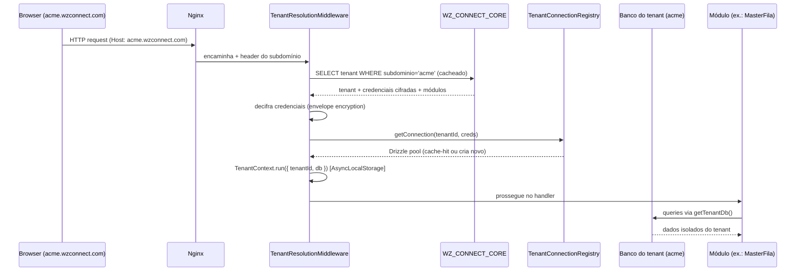
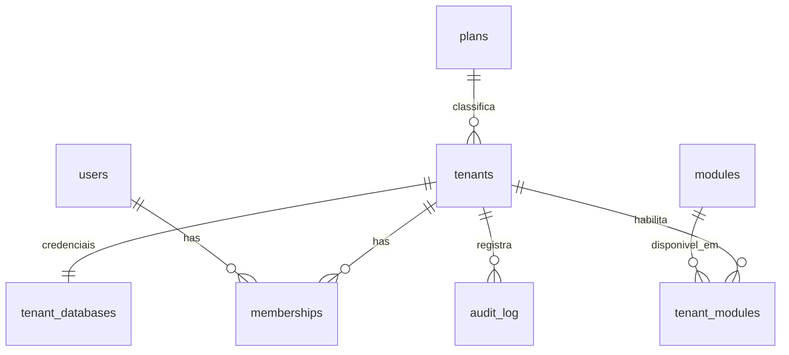

# WZ Connect — Documento de Arquitetura

> **Status:** Proposta (v0.3) — planejamento antes de qualquer código.
> **Data:** 2026-07-14
> **Autor:** Kienzley Huguenin + Claude Code
>
> **Mudança v0.1 → v0.2:** o modelo multi-tenant passa de "banco compartilhado com
> `organization_id`" para **Database Per Tenant**; introduz o banco central
> **WZ_CONNECT_CORE** e a resolução dinâmica de conexão por subdomínio. A suíte deixa de ser
> "satélites via OIDC" e passa a ser um **modular monolith**: uma aplicação compartilhada com
> módulos plugáveis.
>
> **Mudança v0.2 → v0.3:** framework backend **mantido em Fastify** (revertida a proposta de
> NestJS) — consistência com o MasterFila, Vitest nativo e menor risco. Módulos passam a ser
> **plugins Fastify encapsulados**. Adicionada estratégia de pooling/resiliência (ADR-012) e
> política de migração expand/contract (ADR-009).

---

## 1. Visão Geral

O **WZ Connect** é uma **aplicação compartilhada** (React + Fastify) que hospeda todos os
produtos WZ como **módulos plugáveis**, com **isolamento físico de dados por empresa**
(_Database Per Tenant_).

Existe um banco central — **`WZ_CONNECT_CORE`** — responsável por:

- **autenticação global** (identidade e credenciais de usuário);
- **gestão de tenants** (empresas);
- **planos** e **módulos** habilitados por tenant;
- **subdomínios**;
- **credenciais dos bancos** de cada tenant (armazenadas cifradas).

Cada empresa (tenant) possui:

- um **banco PostgreSQL exclusivo** (dados 100% isolados);
- um **subdomínio próprio** (ex.: `acme.wzconnect.com`);
- um **conjunto de módulos** habilitados.

O backend **identifica o subdomínio** da requisição, **consulta o `WZ_CONNECT_CORE`**,
recupera as **credenciais do tenant** e **cria/reutiliza dinamicamente** a conexão com o
banco correto via **Drizzle**. Os módulos do WZ Connect operam sobre o banco do tenant ativo.

### 1.1 Por que esta arquitetura

| Benefício                | Como a arquitetura entrega                                                        |
| ------------------------ | --------------------------------------------------------------------------------- |
| **Isolamento de dados**  | Cada empresa em seu próprio banco — impossível vazamento por query mal filtrada.  |
| **Escalabilidade**       | Bancos podem ser distribuídos em servidores diferentes sem tocar na aplicação.    |
| **Backups individuais**  | Backup/restore por empresa, sem afetar as demais.                                 |
| **Compliance**           | Dados de um cliente fisicamente separados; facilita LGPD e requisitos enterprise. |
| **Manutenção evolutiva** | Migração de schema aplicada por tenant, com rollout controlado.                   |

### 1.2 Princípio norteador

> O **`WZ_CONNECT_CORE`** é a fonte da verdade sobre _quem é o usuário_, _qual empresa é o
> tenant_, _quais módulos ela tem_ e _onde vive o banco dela_. Os módulos são **consumidores**
> do contexto de tenant resolvido a cada requisição — nunca decidem sozinhos a qual banco falar.

---

## 2. Leis do Projeto (inegociáveis)

Verificadas em CI a cada commit:

1. **TDD é lei** — nenhum código de produção sem teste que falhou antes (Red → Green → Refactor). PR sem teste correspondente é bloqueado.
2. **DRY é lei** — lógica compartilhada vive em `packages/shared` ou em um módulo de domínio único. Duplicação é _code smell_ barrado em review.
3. **Commit atômico** — um commit = uma mudança coesa que compila e passa nos testes. Conventional Commits (`feat:`, `fix:`, `test:`, `refactor:`, `chore:`, `docs:`).
4. **Cobertura ≥ 85%** nos módulos unit-testáveis (funções puras + services sem dependência de DB/HTTP), medida por Vitest, travada em pre-push (Husky) e CI.
5. **Design patterns explícitos** — documentados via ADR (§15).
6. **Git flow** — `main` (produção, protegida) ← `develop` (integração) ← `feature/*`, `fix/*`, `chore/*`. Sem push direto em `main`/`develop`.

---

## 3. Stack Técnica

- **Backend:** Node.js 20 LTS, **Fastify 5.x**, **Drizzle ORM**, PostgreSQL 16, `@fastify/jwt` + `jose` (JWKS/JWS), `@fastify/rate-limit`, `@fastify/swagger`, `pino` (log estruturado), Argon2 (`@node-rs/argon2`).
- **Frontend:** React 19, TypeScript 5, Vite 6, TailwindCSS 4, React Router 7.
- **Shared:** TypeScript puro — tipos, contratos (schemas Zod), constantes de módulos/planos.
- **Infra:** Docker Compose (postgres-core, backend, frontend, nginx). Bancos de tenant podem viver em instâncias/servidores Postgres distintos.
- **Testing:** Vitest 2.x, cobertura mínima 85%.
- **Qualidade:** ESLint + Prettier, Husky (pre-commit lint, pre-push test+coverage), commitlint.

> **Nota sobre Fastify:** mantido por consistência com o MasterFila (mesma stack da suíte),
> Vitest nativo e menor curva de aprendizado. O modelo de **encapsulamento de plugins** do
> Fastify isola módulos por tenant; `hooks` + `AsyncLocalStorage` resolvem o contexto de
> tenant; DI leve via composição (ou `awilix` se necessário).

---

## 4. Estrutura do Monorepo

```
wz-connect/
├── apps/
│   ├── backend/                  # Fastify — aplicação compartilhada
│   │   └── src/
│   │       ├── core/             # CORE: auth global, tenants, planos, módulos, subdomínios
│   │       │   ├── auth/
│   │       │   ├── tenants/
│   │       │   ├── plans/
│   │       │   ├── modules-registry/
│   │       │   └── db-core/      # schema + conexão do WZ_CONNECT_CORE
│   │       ├── tenancy/          # resolução de tenant + registry de conexões
│   │       │   ├── tenant-resolution.plugin.ts   # onRequest hook (Fastify)
│   │       │   ├── tenant-connection.registry.ts
│   │       │   ├── tenant-context.ts             # AsyncLocalStorage
│   │       │   └── tenant-db.ts                  # getTenantDb()
│   │       ├── modules/          # plugins Fastify de produto (operam no banco do tenant)
│   │       │   └── masterfila/   # ex.: filas, guichês, tickets...
│   │       └── shared/           # hooks, decorators, crypto, error handlers
│   └── frontend/                 # React SPA — shell + telas por módulo
├── packages/
│   └── shared/                   # tipos, contratos Zod, constantes
├── docs/
│   ├── ARQUITETURA.md            # este documento
│   └── adr/                      # Architecture Decision Records
├── docker-compose.yml
├── pnpm-workspace.yaml
└── package.json
```

---

## 5. Arquitetura Multi-Tenant: Database Per Tenant

### 5.1 Dois tipos de banco

| Banco                                    | Conteúdo                                                                                                                 | Quantidade        |
| ---------------------------------------- | ------------------------------------------------------------------------------------------------------------------------ | ----------------- |
| **`WZ_CONNECT_CORE`**                    | Auth global, tenants, planos, módulos, subdomínios, credenciais (cifradas) dos bancos de tenant, auditoria da plataforma | **1** (central)   |
| **Banco do tenant** (`wz_tenant_<slug>`) | Dados de negócio de uma empresa — tabelas de todos os módulos habilitados para ela                                       | **1 por empresa** |

### 5.2 Fluxo de resolução de tenant (por requisição)



Passos:

1. **Identificação** — middleware extrai o subdomínio do `Host` (fallback: header `X-Tenant` ou claim `tnt` do JWT).
2. **Lookup no CORE** — busca o tenant por subdomínio; resultado **cacheado** (TTL curto + invalidação em mudança de tenant).
3. **Decifra credenciais** — as credenciais do banco do tenant são guardadas cifradas no CORE e decifradas em memória.
4. **Obtém conexão** — o `TenantConnectionRegistry` devolve um **pool Drizzle reutilizável** para aquele tenant (cria sob demanda; nunca um pool por request).
5. **Contexto de tenant** — `AsyncLocalStorage` carrega `{ tenantId, db }` por toda a cadeia da request; qualquer service chama `getTenantDb()`.

### 5.3 `TenantConnectionRegistry` (padrão Registry + Object Pool)

- **Cache de pools** por `tenantId`; um `pg.Pool` + instância Drizzle por tenant ativo.
- **Eviction LRU** com teto de pools abertos e **idle timeout** (fecha conexões de tenants inativos).
- **Health check** e reconexão; falha de um tenant não derruba os demais.
- **Isolamento garantido:** uma request só enxerga o pool do seu tenant — impossível cruzar dados.
- **Distribuição futura:** como a credencial inclui host/porta, mover o banco de um tenant para outro servidor é só atualizar o registro no CORE — **zero alteração de código**.

### 5.4 Segurança de credenciais

- Credenciais de banco cifradas no CORE com **envelope encryption** (AES-256-GCM; chave-mestra em variável de ambiente / futuro KMS).
- Nunca logadas, nunca em URL, nunca no frontend.
- Rotação de credencial de tenant sem downtime (atualiza CORE → registry recria o pool no próximo acesso).

---

## 6. Modelo de Domínio

### 6.1 Schema do `WZ_CONNECT_CORE`

```
tenants            ── empresa: id, nome, slug, subdominio, status, plan_id, db_placement
tenant_databases   ── credenciais cifradas: host, porta, dbname, usuario, senha_cifrada, servidor
users              ── identidade GLOBAL: id, email, senha (Argon2), status, tentativas_login, bloqueado_ate
memberships        ── N:N user↔tenant + papel (org_owner/org_admin/org_member)
plans              ── planos: id, nome, limites (JSONB)
modules            ── catálogo de módulos: id, chave (masterfila, ...), nome
tenant_modules     ── módulos habilitados por tenant (+ config JSONB)
signing_keys       ── chaves RSA p/ assinar JWT (rotação + JWKS)
audit_log          ── auditoria da plataforma (login, provisionamento, mudança de plano/creds)
```

### 6.2 Schema do banco do tenant

Cada módulo habilitado contribui com suas tabelas no banco do tenant. Ex.: módulo
**MasterFila** traz `grupos`, `guiches`, `tickets`, `sessoes_caixa`, `paineis`, etc.
As tabelas de módulos coexistem no mesmo banco do tenant e **não** repetem `organizacao_id`
(o isolamento já é físico) — salvo um `tenant_id` opcional de conferência.

> **Regra DRY/migração:** o schema de cada módulo é definido **uma vez** em
> `modules/<mod>/schema.ts` e aplicado a **todos** os bancos de tenant pelo orquestrador de
> migração (§12).

### 6.3 ERD do CORE



### 6.4 RBAC em dois níveis

- **Plataforma** (WZ): `platform_super_admin`, `platform_support` — enxergam o CORE e todos os tenants.
- **Empresa** (tenant): `org_owner`, `org_admin`, `org_member` — via `memberships`.
- **Módulo**: papéis específicos (ex.: MasterFila `admin`/`operador`/`caixa`) resolvidos dentro do módulo, no banco do tenant.

Autorização resolvida por um `AuthorizationService` único (padrão Policy — DRY).

---

## 7. Sistema de Módulos (Plugins Fastify encapsulados)

- Cada produto é um **plugin Fastify** registrado explicitamente no `ModulesRegistry` (ver emenda no ADR-007); o **encapsulamento** do Fastify isola o escopo (hooks, decorators e error handlers do módulo não vazam para os outros).
- Um `ModulesRegistry` cruza os módulos habilitados do tenant (`tenant_modules` no CORE) com os plugins carregados, e um **hook `preHandler`** bloqueia acesso a módulo não contratado (`403 module_not_enabled`).
- O frontend consulta os módulos habilitados e monta a navegação dinamicamente (shell + telas por módulo).
- Contrato de um módulo (interface comum — padrão Adapter): `key`, `schema` (Drizzle), `migrations`, `plugin` (rotas Fastify), `seed?`.

---

## 8. Autenticação Global

- **Login contra o CORE**: e-mail + senha (Argon2). Lockout após 5 tentativas por 15 min (reaproveita lógica testada do MasterFila).
- **JWT** assinado com **RS256** (chave privada no CORE; pública em `/.well-known/jwks.json`).
- **Claims**: `sub` (user global), `tnt` (tenant ativo/subdomínio), `roles`, `mods` (módulos habilitados).
- **Resolução de tenant** prioriza o subdomínio; o claim `tnt` do token é conferido contra ele (defesa contra troca de tenant).
- **Sessão única** por usuário (herda o padrão `sessao_ativa_id` do MasterFila) — novo login invalida o anterior.

---

## 9. Integração dos produtos existentes (MasterFila)

**Decisão (2026-07-14): app separado (B).** O MasterFila continua rodando como aplicação
própria; o WZ Connect é o **control plane** que o provisiona e governa:

- **Auth global** — MasterFila delega login ao Connect (JWT RS256 validado via JWKS).
- **Tenant & banco** — o Connect provisiona o banco do tenant e **entrega as credenciais**
  ao MasterFila via SDK/API; ambos os runtimes falam com o **mesmo banco do tenant**
  (o isolamento físico por empresa é preservado).
- **Módulos & plano** — o Connect define quais módulos/limites a empresa tem; o MasterFila
  consulta esse estado.

Consequências:

- **Dois runtimes** para manter (Connect Fastify + MasterFila atual).
- Contrato de integração isolado no **`@wz/connect-sdk`** (padrão Adapter): validação de
  token, resolução de credenciais do banco do tenant e checagem de módulo/limite. O
  MasterFila nunca fala JWKS/CORE "na mão".
- **Migração incremental** (sem big-bang), com _feature flag_ de corte:
  1. Coexistência — Connect existe; MasterFila mantém auth próprio; CORE espelha tenants/usuários.
  2. Delegação — MasterFila passa a logar via Connect e a pegar credenciais do banco pelo SDK.
  3. Fonte única — CRUD de tenants/usuários/planos só no console do Connect.

---

## 10. Superfície de API (rascunho)

Prefixo REST: `/api/v1`. Contratos tipados em `packages/shared` (Zod → OpenAPI/Swagger).

### 10.1 Identidade / Auth

```
POST /auth/login                 — e-mail+senha → JWT (rate-limited)
GET  /auth/me                    — usuário + tenant + módulos
POST /auth/logout                — encerra sessão
GET  /.well-known/jwks.json      — chaves públicas
```

### 10.2 CORE / Administração de plataforma

```
GET|POST|PUT|DELETE /tenants                 — empresas (+ subdomínio, plano)
POST                /tenants/:id/provisionar  — cria banco + migra + seed + registra creds
GET|PUT             /tenants/:id/database     — credenciais/placement (cifrado)
GET|POST|PUT|DELETE /plans
GET|POST|PUT|DELETE /modules
PUT                 /tenants/:id/modules      — habilita/desabilita módulos do tenant
GET                 /auditoria
```

### 10.3 Módulos (operam no contexto do tenant resolvido)

```
/api/v1/masterfila/*             — rotas do módulo MasterFila (tenant via subdomínio)
...                              — demais módulos
```

---

## 11. Padrões de Design (documentados como ADRs)

| Padrão                           | Onde                                | Por quê                                                                                    |
| -------------------------------- | ----------------------------------- | ------------------------------------------------------------------------------------------ |
| **Registry + Object Pool**       | `TenantConnectionRegistry`          | Cache e reuso de conexões Drizzle por tenant; eviction e isolamento.                       |
| **Ambient Context**              | `TenantContext` (AsyncLocalStorage) | Propaga `{ tenantId, db }` pela request sem passar parâmetro em toda função.               |
| **Strategy**                     | `db_placement` / provisionadores    | Escolhe em qual servidor Postgres o banco do tenant nasce (padrão vs dedicado enterprise). |
| **Repository**                   | acesso a dados (Drizzle)            | Isola domínio do ORM; testável com fakes.                                                  |
| **Adapter**                      | contrato de módulo                  | Todos os módulos expõem a mesma interface (schema, migrations, rotas).                     |
| **Plugin encapsulado (Fastify)** | `modules/*`                         | Módulos plugáveis registrados via `ModulesRegistry`, escopo isolado.                       |
| **Factory**                      | JWT / chaves de assinatura          | Centraliza construção de tokens e chaves.                                                  |
| **Policy**                       | `AuthorizationService`              | Regra de autorização única (DRY).                                                          |

---

## 12. Migrações e Provisionamento (Database Per Tenant)

Ponto crítico da arquitetura — há **dois conjuntos** de migração:

1. **Migrações do CORE** — schema do `WZ_CONNECT_CORE`, aplicadas uma vez.
2. **Migrações de tenant** — schema dos módulos, aplicadas a **cada** banco de tenant.

**Orquestrador de migração de tenant** (`tenant-migrator`):

- Lê a lista de tenants ativos no CORE.
- Para cada banco: conecta, aplica migrações Drizzle pendentes, registra o journal por tenant.
- Idempotente e resiliente: falha em um tenant é reportada e não bloqueia os demais.

**Provisionar um novo tenant** (`POST /tenants/:id/provisionar`):

```
1. Cria o banco do tenant (no servidor definido por db_placement)
2. Roda TODAS as migrações de módulos habilitados
3. Seed inicial (usuário admin do tenant, config padrão)
4. Registra credenciais cifradas + subdomínio no CORE
5. Marca tenant como 'ativo'
```

---

## 13. Segurança (defesa em profundidade)

1. **Isolamento físico** por banco — barreira mais forte que filtro por coluna.
2. **Credenciais cifradas** no CORE (AES-256-GCM, envelope encryption); rotação sem downtime.
3. **Conferência subdomínio × claim `tnt`** — impede uso de token de um tenant em outro.
4. **Rate limiting** global + agressivo em `/auth/login`.
5. **Account lockout** (5 tentativas → 15 min).
6. **Argon2** (senha) + **RS256/JWKS** (token); rotação de chaves sem downtime.
7. **Audit log** imutável no CORE (login, provisionamento, mudança de plano/credenciais).
8. **Testes de isolamento** entre tenants obrigatórios (um tenant nunca acessa o pool de outro).

---

## 14. Roadmap por Fases (cada fase = incremento testado e entregável)

| Fase                         | Objetivo                    | Entregáveis principais                                                                                                               | Gate                                            | Status                                                                                                                                      |
| ---------------------------- | --------------------------- | ------------------------------------------------------------------------------------------------------------------------------------ | ----------------------------------------------- | ------------------------------------------------------------------------------------------------------------------------------------------- |
| **0 — Fundação**             | Esqueleto do repo           | Monorepo pnpm, Fastify, git flow, CI (lint+test+coverage 85%), Docker Compose (postgres-core), schema+migração do CORE, health check | CI verde                                        | ✅ concluída (2026-07-14)                                                                                                                   |
| **1 — Tenancy core**         | Resolução dinâmica de banco | Hook de subdomínio, `TenantConnectionRegistry`, `TenantContext`, cifra de credenciais, 1º banco de tenant conectando                 | Request resolve tenant e lê banco isolado (E2E) | ✅ concluída (2026-07-14)                                                                                                                   |
| **2 — Auth global**          | Login e sessão              | Argon2, lockout, JWT RS256+JWKS, sessão única, guards                                                                                | Cobertura ≥85%, login E2E                       | ✅ concluída (2026-07-14)                                                                                                                   |
| **3 — Sistema de módulos**   | Módulos plugáveis           | `ModulesRegistry`, registro de plugins encapsulados, guard `module_not_enabled`, navegação dinâmica no frontend                      | Módulo habilita/desabilita por tenant           | ✅ concluída (2026-07-14)                                                                                                                   |
| **4 — Provisionamento**      | Criar tenant fim-a-fim      | `tenant-migrator`, `POST /provisionar` (cria banco+migra+seed), `db_placement` (Strategy)                                            | Novo tenant provisionado do zero                | ⬜ pendente                                                                                                                                 |
| **5 — 1º módulo de produto** | Valor real                  | MasterFila como módulo (ou integração — §9), operando no banco do tenant                                                             | Módulo funcional isolado por tenant             | ⬜ pendente                                                                                                                                 |
| **6 — Licenciamento & BI**   | Planos e painel             | Planos/limites, painel consolidado (BI por push dos módulos)                                                                         | Entitlement barra feature; dashboard com dados  | 🟡 **parcial**: licenciamento ✅ adiantado (planos/limites, entitlements, claims `tnt`/`roles`/`mods`, binding subdomínio×tnt); BI pendente |

> **Nota de execução (2026-07-14):** o licenciamento da Fase 6 foi adiantado junto com o guard
> de módulo da Fase 3 (ambos dependem de `tenant_modules`/`plans`). O modelo de licenciamento
> usa **`plans` (limites JSONB) + `modules` + `tenant_modules` + `memberships`** — e não
> `products`/`subscriptions`, que eram do modelo v0.1 (pré-modular-monolith).

> Cada fase abre `feature/*` a partir de `develop`, com PR + review + squash mantendo commits atômicos.

---

## 15. ADRs previstos (`docs/adr/`)

| #       | Título                                                                                |
| ------- | ------------------------------------------------------------------------------------- |
| ADR-001 | Monorepo pnpm workspaces                                                              |
| ADR-002 | **Fastify** como framework backend                                                    |
| ADR-003 | Drizzle ORM + Repository pattern                                                      |
| ADR-004 | **Database Per Tenant** com banco central `WZ_CONNECT_CORE`                           |
| ADR-005 | Resolução dinâmica de conexão (Registry + Object Pool + AsyncLocalStorage)            |
| ADR-006 | Cifra de credenciais de tenant (envelope encryption)                                  |
| ADR-007 | Sistema de módulos via plugins Fastify encapsulados                                   |
| ADR-008 | Autenticação global (Argon2 + JWT RS256/JWKS + sessão única)                          |
| ADR-009 | Orquestração de migrações por tenant + provisionamento                                |
| ADR-010 | TDD, cobertura 85%, commit atômico e git flow                                         |
| ADR-011 | Integração de produtos via `@wz/connect-sdk` (Adapter) — MasterFila como app separado |
| ADR-012 | Estratégia de pooling e resiliência (PgBouncer + circuit breaker)                     |

---

## 16. Decisões e questões em aberto

### Decisões travadas (2026-07-14)

| Tema                     | Decisão                                                                                                           |
| ------------------------ | ----------------------------------------------------------------------------------------------------------------- |
| **Framework backend**    | ✅ **Fastify** (mantido; proposta de NestJS revertida na v0.3).                                                   |
| **Multi-tenancy**        | ✅ **Database Per Tenant** + banco central `WZ_CONNECT_CORE`.                                                     |
| **Resolução de tenant**  | ✅ Por **subdomínio** → lookup no CORE → conexão Drizzle dinâmica cacheada.                                       |
| **Cobrança**             | ✅ **Só registro de plano** (sem gateway de pagamento agora).                                                     |
| **Provisionamento**      | ✅ **Híbrido** — banco de tenant em servidor padrão; servidor dedicado para enterprise (Strategy `db_placement`). |
| **BI**                   | ✅ **Push** — módulos empurram métricas para o painel consolidado.                                                |
| **Usuário multi-tenant** | ✅ **Sim** — `memberships` N:N no CORE.                                                                           |

| **Integração MasterFila** | ✅ **App separado (B)** — integra via `@wz/connect-sdk`; compartilha o banco do tenant. |

### Em aberto

1. **Domínio** — subdomínio por tenant (`acme.wzconnect.com`) confirmado; falta decidir o domínio real e o wildcard TLS.

---

_Fim do documento v0.3. Próximo passo sugerido: iniciar a Fase 0 (scaffold Fastify + CORE + CI) com TDD._
